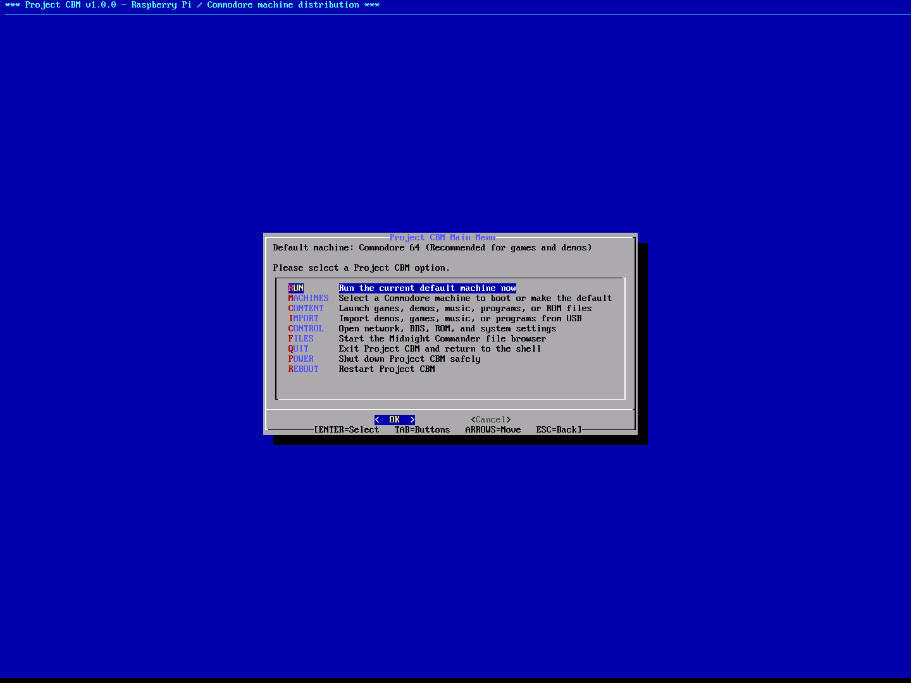
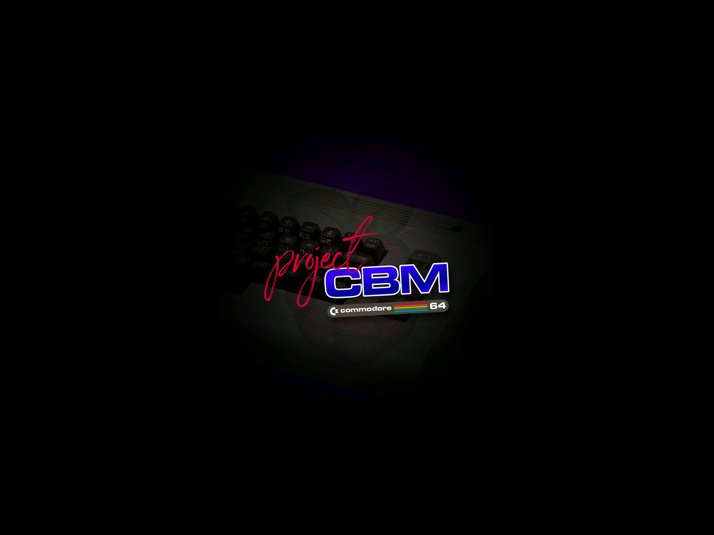

[](https://github.com/cdaters/project-cbm/releases/tag/v1.1.0) [](docs/release/getting-started.md#hardware) [](LICENSE.md)

# Project CBM

Project CBM turns a Raspberry Pi into a keyboard-operated Commodore computer
collection. Switch it on, choose a machine, and arrive at BASIC or launch your
games, demos and programs. Machine artwork, called **Covers**, identifies the
computer as it starts. **F10 → Quit** brings you back to Project CBM.

Built on Raspberry Pi OS Lite (64-bit), based on Debian 13 “Trixie”, with SDL2 VICE
and a Bash/dialog Menu. No desktop or cloud account is required. You retain normal
Linux terminal and administrator access.

## Current Release

**Project CBM 1.1.0 is released.** [Release page and notes](https://github.com/cdaters/project-cbm/releases/tag/v1.1.0).
The final image passed the owner's Raspberry Pi 4 B smoke test, including an
end-to-end CCGMS/TCPser BBS connection, reboot and shutdown.

## What Is Included

- VICE 3.10 and eleven profiles covering C64, SuperCPU 64, C64 DTV, C128
  (40/80 columns), VIC-20, Plus/4, PET and the CBM-II families.
- Guided first boot, keyboard Menu, machine Covers and a shared emulator-return path.
- Organized content library and USB import with a read-only source and safe unmount.
- CCGMS 2021 for BBS calls through TCPser, plus SID-Wizard for creating music.
- Midnight Commander file management; opt-in file sharing, SSH and network discovery.

In **1.1.0**, IMPORT scans the selected USB partition recursively and preserves
relative folders; it does not offer preview or per-file selection. Online Library
and the redesigned USB workflow are future work. Bring software you are entitled
to use; a recognized file format does not establish redistribution rights.

## Hardware Support

**Raspberry Pi 4 B is physically qualified for this release.** Pi 400, Pi 5 and
Pi 500-class systems are targets requiring separate model qualification. Pi 3 and
Zero-class hardware are outside the 1.1 target. See [hardware and setup requirements](docs/release/getting-started.md#hardware).
A supported machine profile is not a claim that every workload or peripheral has
been tested.

## Screenshots

These retained **1.0.0** images illustrate the project's appearance; they are not
screenshots of 1.1.0. Menu labels and behavior have changed. No replacement screens
have been fabricated.




[Historical gallery](docs/screenshots.md) · [Current screenshot capture checklist](docs/release/screenshot-checklist.md)

## Download

- [Project CBM 1.1.0 compressed image — project-cbm-1.1.0.img.xz](https://github.com/cdaters/project-cbm/releases/download/v1.1.0/project-cbm-1.1.0.img.xz)
- [SHA256SUMS](https://github.com/cdaters/project-cbm/releases/download/v1.1.0/SHA256SUMS)
- [All release assets, source archives, notices and inventory](https://github.com/cdaters/project-cbm/releases/tag/v1.1.0)

Verify the compressed image before flashing. Its SHA-256 is:

```text
8b3738a204da16e148f5674a95f1ffb55a67b8ad1ce1d997b1858594a899c13d
```

The download is 599,290,700 bytes and expands to a 3,095,396,352-byte image.
Allow additional space for setup, updates and your library. The raw image is not a
public asset; extract the XZ only if your imaging tool needs it. GitHub's source
ZIP/TAR files are not bootable images.

## Getting Started / Documentation

| I want to… | Read this |
| --- | --- |
| Verify, flash and reach C64 BASIC | [Getting Started](docs/release/getting-started.md) |
| Learn everyday Menu tasks | [User Manual](docs/release/user-guide.md) |
| Add content or import USB files | [Content and USB](docs/release/content.md) |
| Share files, enable SSH or call a BBS | [Networking and services](docs/release/networking.md) |
| Fix a problem or protect my files | [Troubleshooting](docs/release/troubleshooting.md) and [backup/recovery](docs/release/recovery.md) |

[Documentation index](docs/README.md) · [Support](SUPPORT.md)

## Development / Repository Layout

Product owns OS/runtime integration, image construction and authoritative user
documentation. [Project CBM Menu](https://github.com/cdaters/project-cbm-menu) owns
Menu presentation, scripts, artwork and its independently versioned package.
The active public development/documentation branch is `feature/1.1-build-foundation`;
`main` is retained as historical repository history.

- `runtime/`: appliance integration and validated operations.
- `build/`, `tools/`, `tests/`: factory recipes, engineering tools and checks.
- `docs/release/`: current user and developer guides.
- `docs/design/`: design decisions and future work.

Start with [Development](docs/release/development.md), [Contributing](CONTRIBUTING.md)
or [Build Your Own](docs/release/build-your-own.md). The public first-build bootstrap
is not yet complete; a published image is not a claim of independent reproducibility.

## Roadmap

The owner has accepted a unified content-ingestion design for provisional **1.2.0**:
USB preview/selection under CONTENT, separate read-only USB browsing, and Online
Library with Assembly64 once legitimate service access is established. These
features are **not implemented in 1.1.0**. [Roadmap](docs/design/post-1.1-roadmap.md).

## License / Upstream Software

Project-owned code and documentation use [MIT](LICENSE.md). Upstream software,
artwork and supplied content have their own terms; the MIT badge is not a blanket
license for the image. See [software and rights](docs/release/software-components.md),
[release policy](docs/release/release-policy.md) and [acknowledgements](ACKNOWLEDGEMENTS.md).

## Project History / Maintainer Records

[Current engineering checkpoint](CURRENT-STATE.md) · [Architecture](docs/architecture.md)
· [Provenance](docs/provenance.md) · [Security history](docs/security.md)
· [Engineering recovery](docs/recovery.md) · [Historical 1.0 notes](docs/v1.0-current-notes.md).
These preserve earlier audits and qualification evidence without replacing current
user instructions.

The immutable Product `v1.1.0` tag identifies the frozen binary-source snapshot.
Later repository documentation records clarifications and engineering work;
[publication identities](docs/build/published-1.1.0.json) and the release manifest
record the exact release source/documentation snapshots.
