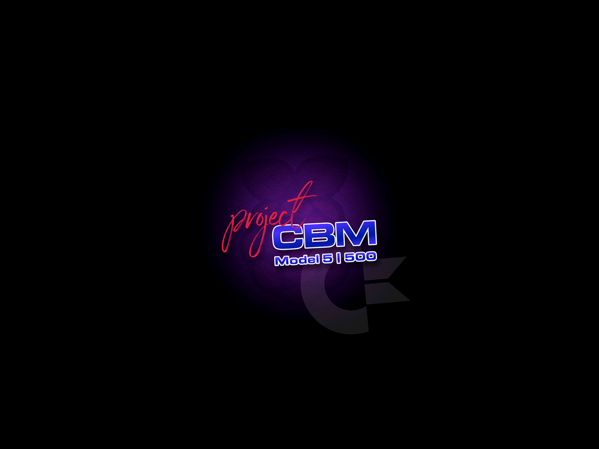
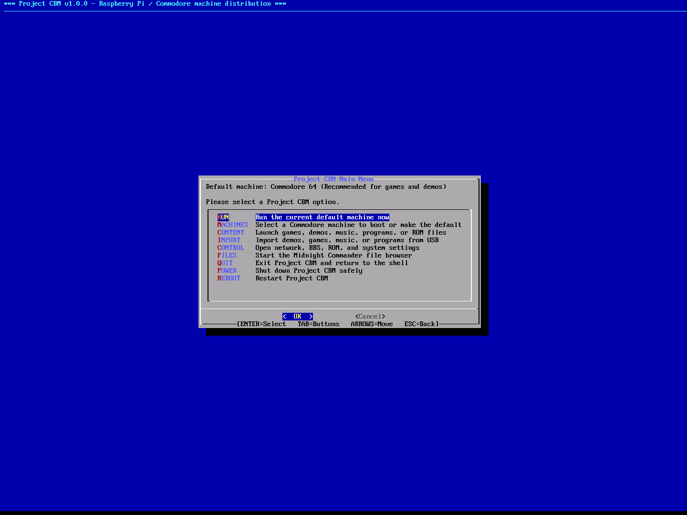
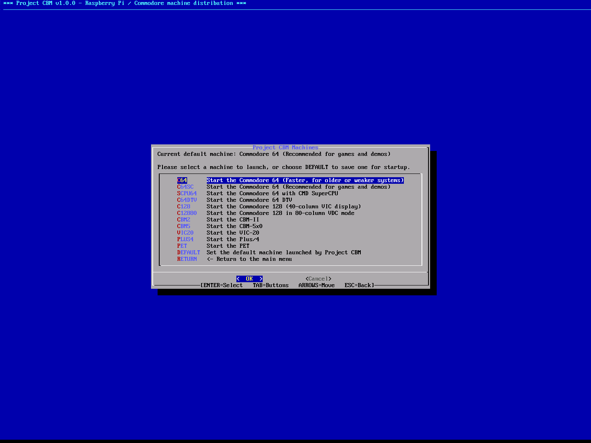
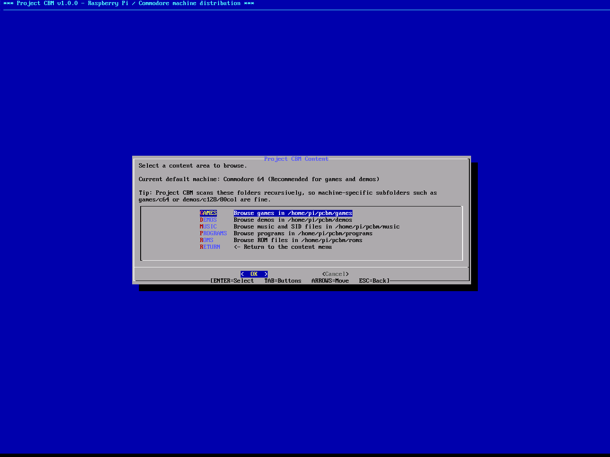
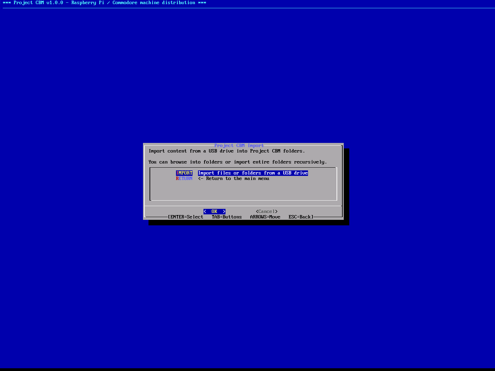
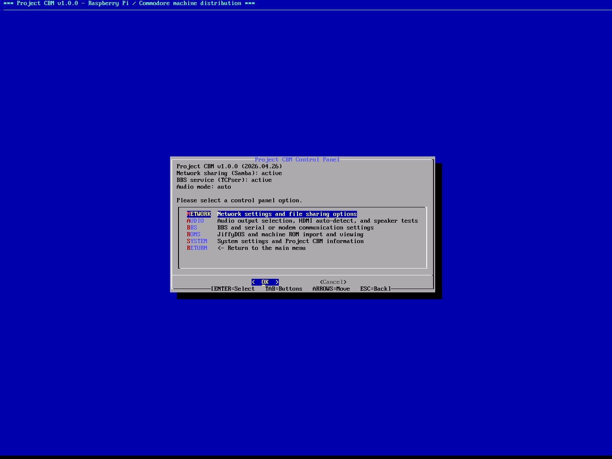
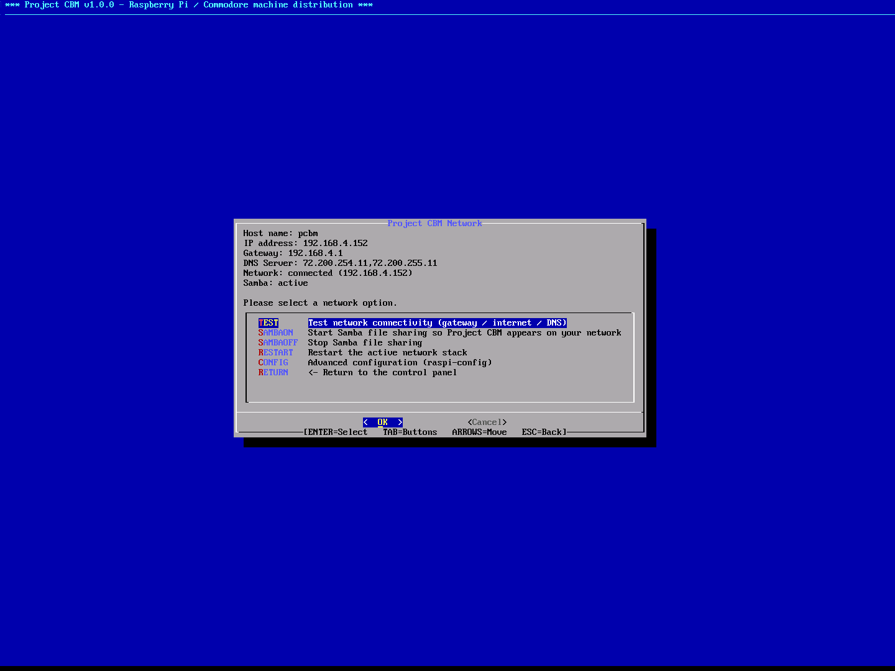
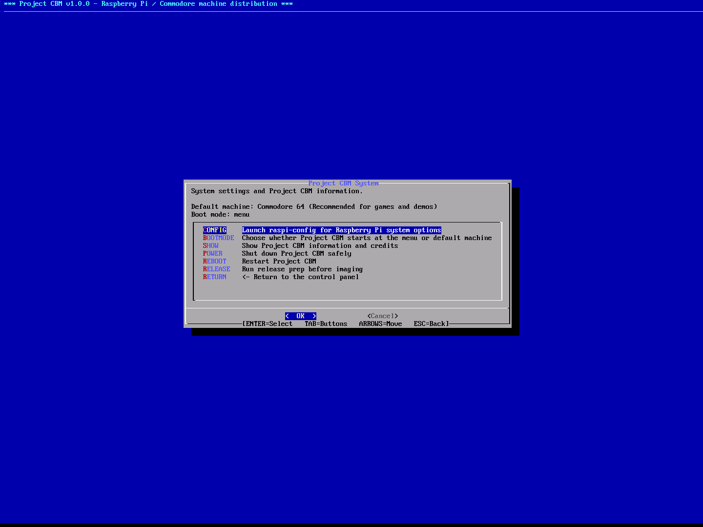
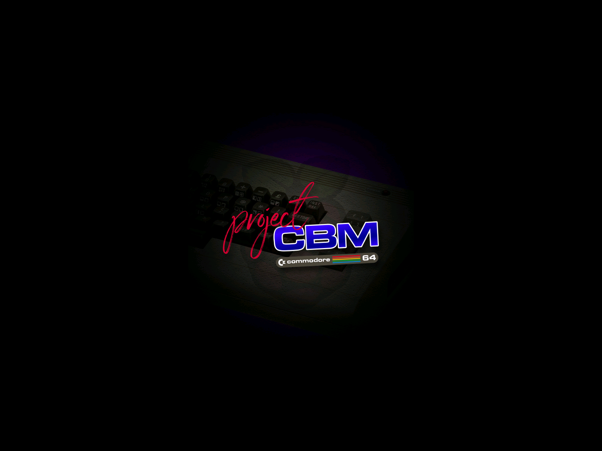
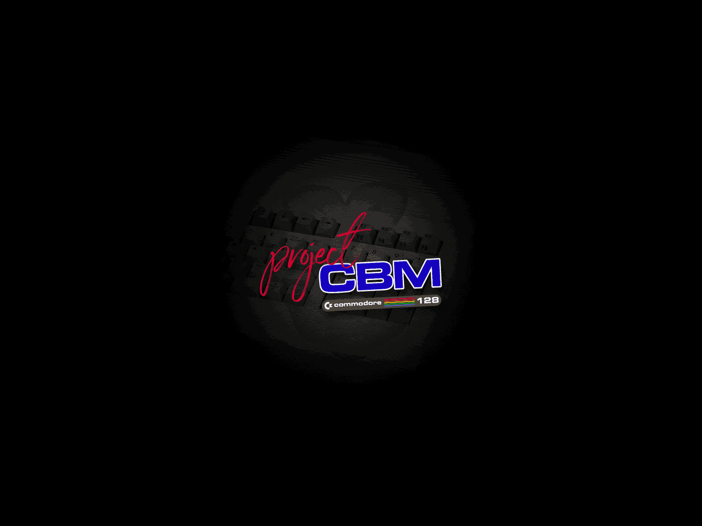

# Project CBM Screenshot Gallery

Screenshots from Project CBM v1.0.0.

## Splash / Cover Screen

## Main Menu

## Machines Menu

## Content Menu

## Import Menu

## Control Panel

## Network Menu

## System Menu

## VICE Emulator

