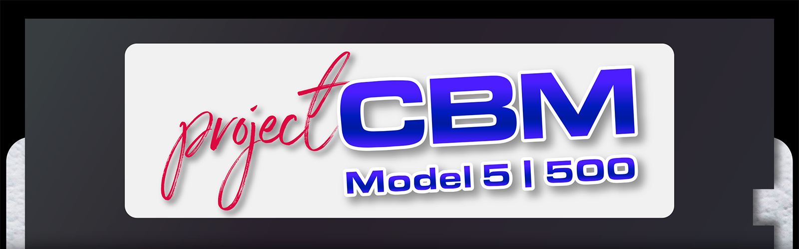
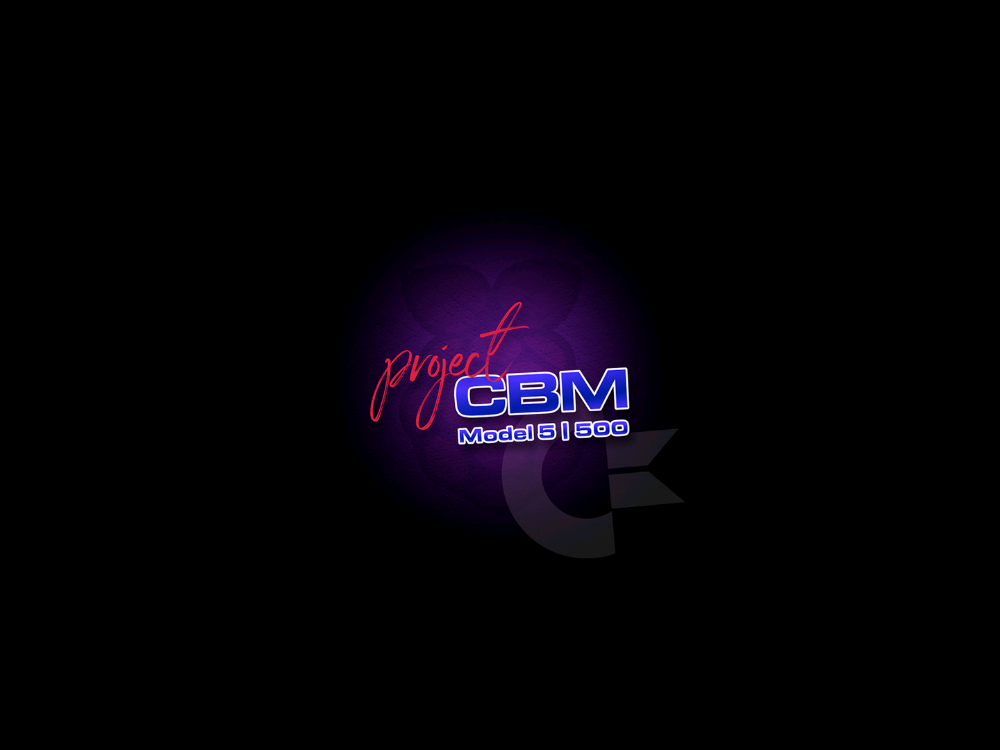
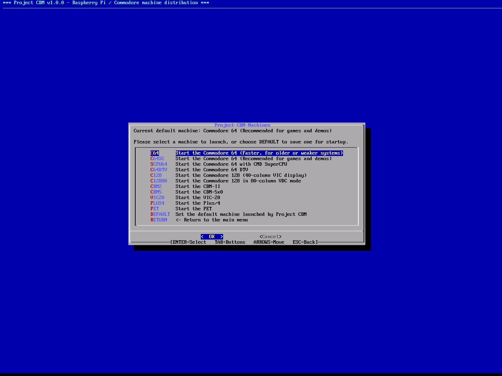
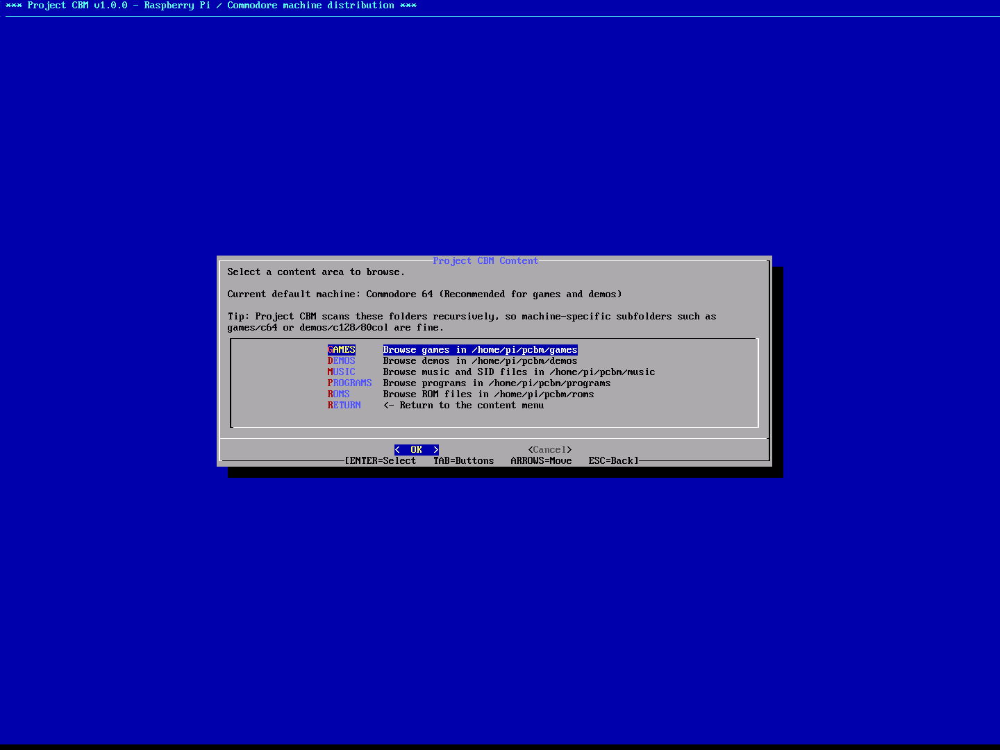
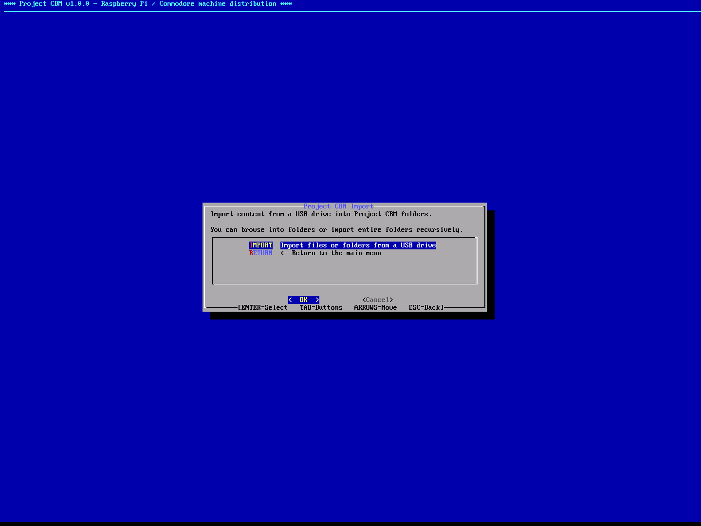
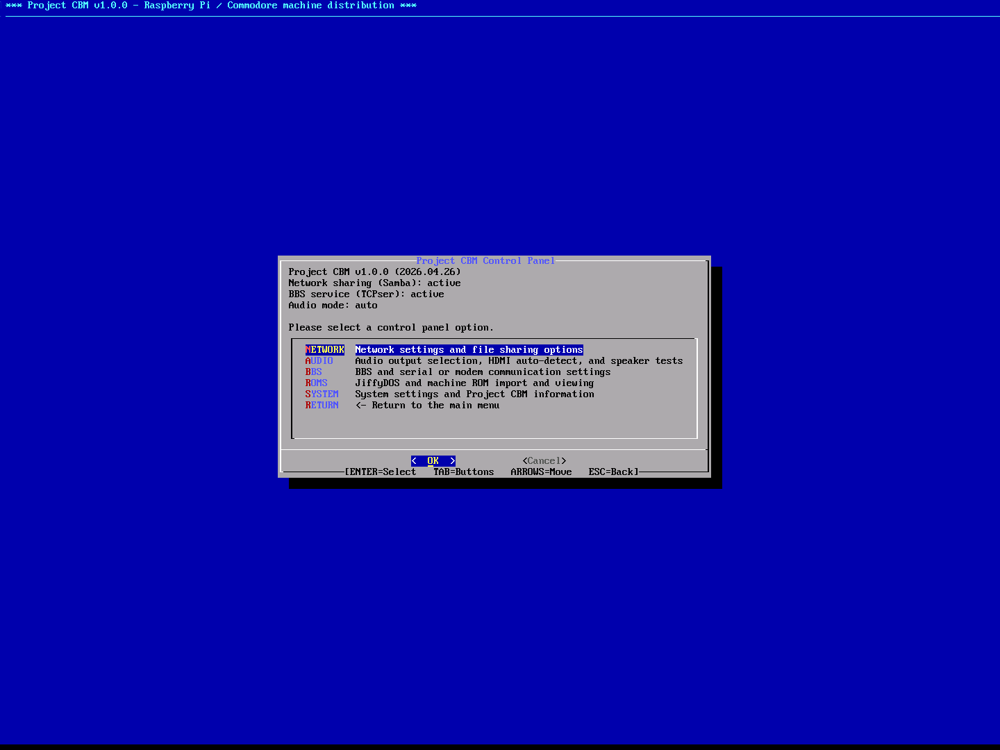
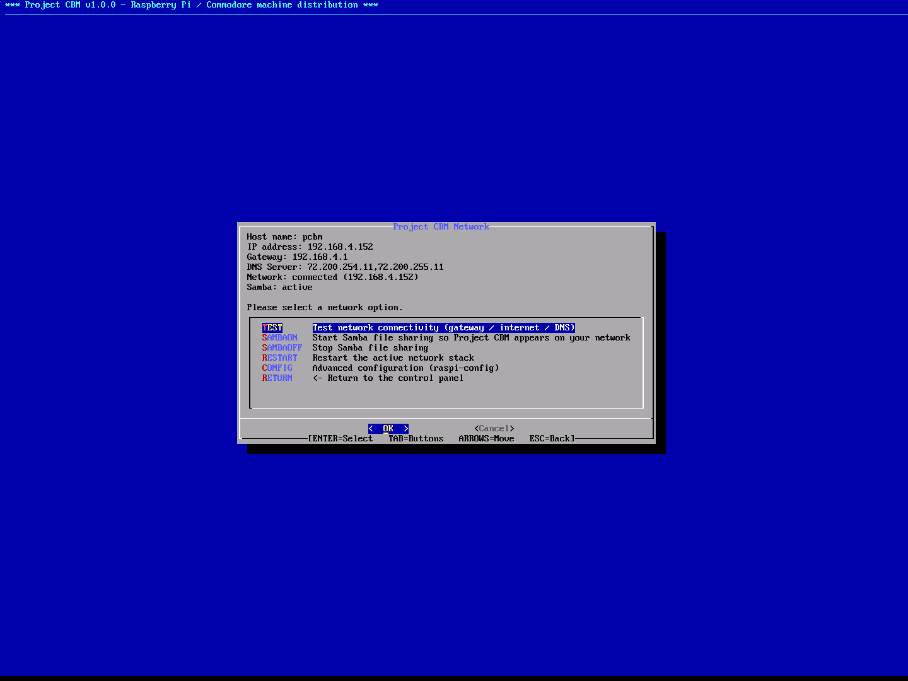
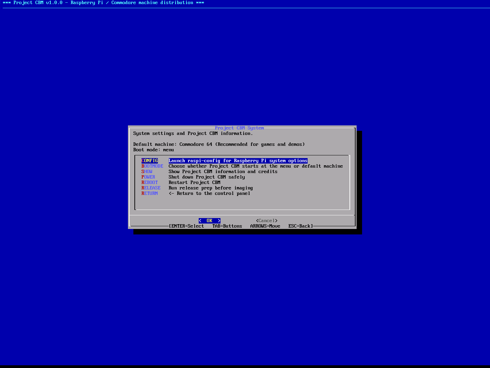
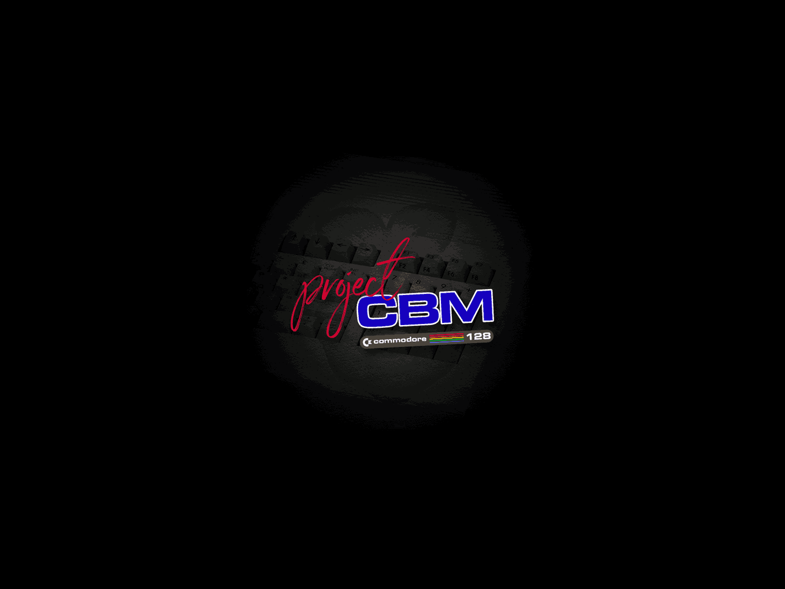

# Project CBM Screenshot Gallery

Historical screenshots/artwork from Project CBM v1.0.0. They are retained unchanged
and do not illustrate the current 1.1.0 Menu labels, hardware qualification or
service defaults. See the [current manual](release/user-guide.md) and
[1.1.0 capture checklist](release/screenshot-checklist.md).

The Project CBM README banner is branding artwork, not a Pi 5/500
qualification claim:

## Splash / Cover Screen

## Main Menu

## Machines Menu

## Content Menu

## Import Menu

## Control Panel

## Network Menu

## System Menu

## Historical machine presentation

The C64 and C128 images below show Cover artwork before emulation, not running
VICE screens.

